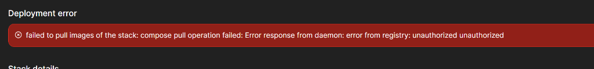
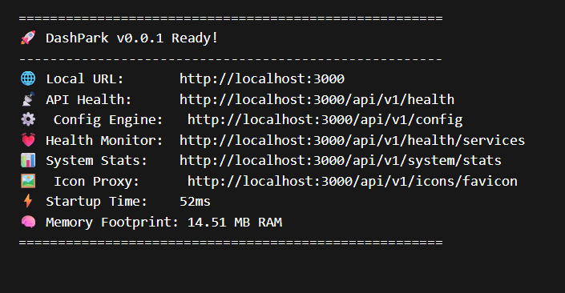
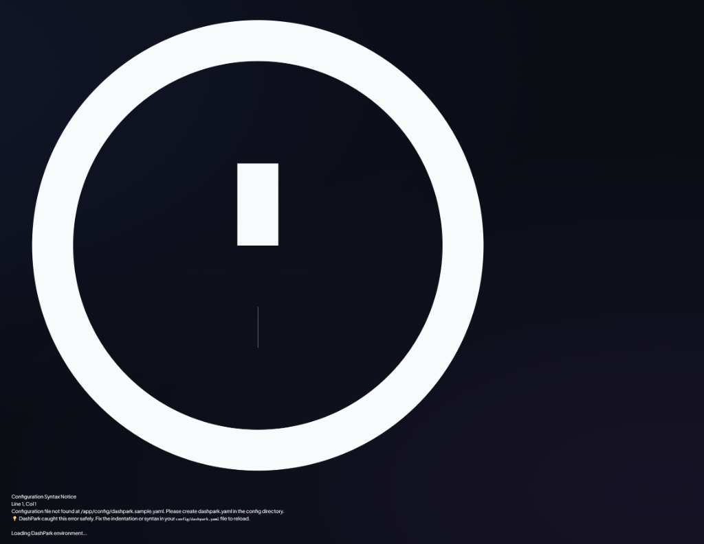
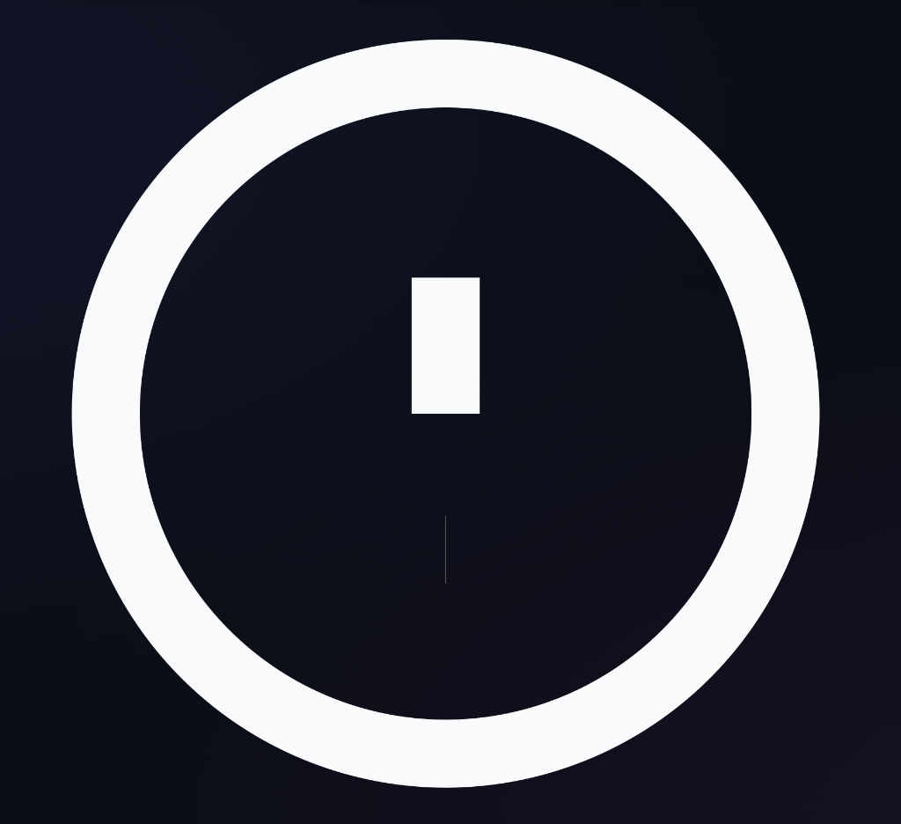

# 🚀 DashPark

<div align="center">

**The Apple/Linear-grade, ultra-lightweight, resilient, and modern self-hosted dashboard for homelabs and server parks.**

[](https://github.com/jack11122233311/DashPark/releases)
[](https://github.com/jack11122233311/DashPark/pkgs/container/dashpark)
[](#-docker-compose-quickstart)
[](#-why-dashpark)
[](tests/)
[](LICENSE)

<br/>

[Docker Quickstart](#-docker-compose-quickstart) • [Visual Tour](#-visual-tour--screenshots) • [Why DashPark?](#-why-dashpark) • [Features](#-core-capabilities) • [Configuration](#-configuration) • [Architecture](#-zero-bloat-architecture)

<br/>



</div>

---

## ⚡ 1-Command Docker Compose Quickstart

> [!TIP]
> **Zero-Configuration Volume Auto-Seeding**: No manual directory or config file creation (`mkdir`) is required! DashPark detects empty volume mounts and automatically auto-seeds a rich homelab dashboard on first boot.

### 1. Create `docker-compose.yml`

```yaml
services:
  dashpark:
    image: ghcr.io/jack11122233311/dashpark:latest
    container_name: dashpark
    restart: unless-stopped
    ports:
      - "3000:3000"
    volumes:
      - ./config:/app/config
      - /var/run/docker.sock:/var/run/docker.sock:ro # Optional: enables live Docker container discovery
    environment:
      - NODE_ENV=production
      - PORT=3000
      - TZ=UTC
```

### 2. Launch DashPark

```bash
docker compose up -d
```

Open **`http://localhost:3000`** (or your server IP) in your browser.

---

## 📸 Visual Tour & Screenshots

### 🍱 Bento Drag-and-Drop Tile Studio
Customize your dashboard in real time with interactive HTML5 drag-and-drop tile reordering, span cycling (`1x1` standard, `2x1` wide, `1x2` tall, `2x2` hero), and embedded live latency sparklines.

<div align="center">
  
</div>

---

### ⚡ Spotlight Command Palette (`Ctrl+K` / `⌘K`)
Press `Ctrl+K`, `⌘K`, or `/` anywhere to launch the Spotlight Command Palette. Universally search and execute actions across all services, shortcuts, dashboard pages, theme palettes, layout modes, and system settings with instant fuzzy filtering and keyboard navigation.

---

### 📊 High-Density Compact List View (`Ctrl+3`)
Engineered for massive homelabs with 50+ services. Enjoy responsive table reflow, inline telemetry badges, and 60fps smooth scrolling.

<div align="center">
  
</div>

---

### ⚙️ 2-Column Split-Pane Settings Hub (`Ctrl+E`)
A unified master-detail configuration center across 11 categorized panels: Identity, Wallpaper & Glassmorphism, Zero-API-Key Weather, Master PIN Protection, Webhook Outage Alerts, 1-Click Migration Importers, Custom CSS & Icons, and Snapshot History.

<div align="center">
  
</div>

---

## 🥊 Why DashPark?

| Feature | 🚀 DashPark | Homepage | Homarr | Dashy |
| :--- | :---: | :---: | :---: | :---: |
| **Idle Memory (RAM)** | **~18 - 25 MB** | ~40 MB | 160 MB+ | 120 MB+ |
| **Cold Startup Time** | **< 60 ms** | ~500 ms | 3-5 s | 2-4 s |
| **Empty Volume Auto-Seeding** | **Automatic (Zero-Error)** | Manual file copy | DB setup | Manual build |
| **Floating Action Dock** | **Apple-Style Glass Dock** | None | Top Navbar | Header Bar |
| **Spotlight Command Palette** | **`Ctrl+K` / `⌘K` Built-in** | None | Partial | Search input |
| **Zero-Clip Responsive Engine** | **Guaranteed (All Views)** | Variable | Layout shifts | Clipping on mobile |
| **In-App Visual & YAML Editor** | **Hybrid Form + YAML** | Text editor only | Form only | Complex editor |
| **Multi-Dashboard Importer** | **Homepage/Homarr/Dashy** | None | None | None |
| **Outage Webhook Dispatcher** | **Discord/Telegram/Ntfy** | None | Partial | Webhook only |
| **Multi-Arch Support** | **`amd64` & `arm64` (RPi)** | `amd64` & `arm64` | `amd64` & `arm64` | `amd64` & `arm64` |

---

## 🌟 Core Capabilities

- 🛸 **Apple-Style Floating Action Dock**: Smooth segmented layout switcher (`Grid`, `Bento`, `List`), theme swatches popover, Quick-Add (`➕`), and Kiosk Wallboard toggle.
- ⚡ **Universal Spotlight Command Palette (`Ctrl+K` / `⌘K`)**: Rapid search across services, pages, themes, and configuration actions.
- 🍱 **Bento Drag-and-Drop Studio**: Live visual customization with dynamic tile dimensions (`1x1` to `2x2`) and real-time sparkline telemetry.
- 🚨 **Real-Time Outage Alerts & Toast Notifications**: Non-intrusive floating toast notifications on health transitions (`offline`, `degraded`, `online` recovery) with top outage ribbon filtering.
- 📺 **Kiosk Multi-Page Auto-Rotation Wallboard**: Slideshow cycling across dashboard pages with an animated progress bar and smart pause on user interaction.
- 🔒 **PIN Kiosk Protection (`/api/v1/auth/*`)**: SHA-256 master PIN protection for settings and tile reordering on public displays.
- 🐳 **Docker Socket Auto-Discovery**: Automatic service discovery via container label taxonomy (`dashpark.enable=true`, `dashpark.name`, `dashpark.icon`, `dashpark.group`) with container restart controls.
- 🌤️ **Zero-API-Key Weather Telemetry**: Live local weather powered by Open-Meteo with dynamic weather icons and condition descriptions.
- 📦 **1-Click Migration Importers**: Drag-and-drop instant migration from **Homepage** (`services.yaml`), **Homarr** (`JSON`), **Dashy** (`conf.yml`), and **Heimdall** (`export.json`).
- 🌐 **Public Shareable Status Page (`/api/v1/status/public`)**: Sanitized uptime availability percentage and system status without exposing private network IPs.
- ⌨️ **Spatial Keyboard & Vim Navigation**: Navigate service cards using Arrow Keys or Vim keys (`h j k l`), `Enter`/`o` to launch, `s` to copy URL, and `?` for the interactive shortcuts cheatsheet.
- 🎨 **7 Curated Theme Palettes**: Dark (Default), Nord, Dracula, Catppuccin, Cyberpunk, Glass, and Light with dynamic CSS custom properties.
- 🖼️ **Live Wallpaper Studio & Glassmorphism 2.0**: Custom background image wallpapers with real-time backdrop blur and card opacity sliders.
- 🎯 **Smart 6-Tier Icon Resolver**: Local `/icons/` ➔ `dashboard-icons` ➔ Simple Icons ➔ Favicon Proxy ➔ Lucide SVG Vectors ➔ Initials Badges with zero layout shift.

---

## ⚙️ Configuration

DashPark checks for configuration files in the following order:
1. `config/dashpark.yaml`
2. `config/dashpark.yml`
3. `config/dashpark.json`
4. `config/dashpark.sample.yaml` (Built-in template)

### Sample `dashpark.yaml`

```yaml
version: "0.8.0"

meta:
  title: "DashPark"
  subtitle: "Personal Homelab & Server Park"
  theme: "dark" # dark, nord, dracula, catppuccin, cyberpunk, glass, light
  accentColor: "#6366f1"
  layout: "grid" # grid, bento, compact
  showClock: true
  clockFormat: "24h"
  weather:
    enabled: true
    city: "San Francisco"

pages:
  - id: "overview"
    name: "Overview & Hub"
    icon: "home"
    categories:
      - id: "media"
        name: "Media & Streaming"
        icon: "film"
        services:
          - id: "plex"
            name: "Plex Media Server"
            url: "http://plex.local:32400"
            icon: "plex"
            description: "Movies & TV Streaming"
            pingUrl: "http://plex.local:32400/web/index.html"
            target: "_blank"
            tags: ["media", "movies"]

          - id: "jellyfin"
            name: "Jellyfin"
            url: "http://jellyfin.local:8096"
            icon: "jellyfin"
            description: "Open-Source Media System"
            target: "_blank"
            tags: ["media", "streaming"]
```

---

## 🏛️ Zero-Bloat Architecture

DashPark is engineered with a strict zero-overhead philosophy:
- **Backend Engine**: Node.js Native ESM + **Fastify** (<25MB idle RAM, asynchronous non-blocking event loop).
- **Frontend Architecture**: **Vite + Vanilla TypeScript & CSS Design System** (Zero heavy UI framework overhead).
- **Security**: Runs unprivileged as non-root user `node` (UID: 1000) inside container.
- **Config Parser**: Resilient AST parser with line/column diagnostic pointers preventing crashing on syntax typos.

---

## 📄 License

Distributed under the [MIT License](LICENSE). Copyright (c) 2026 DashPark Contributors.
